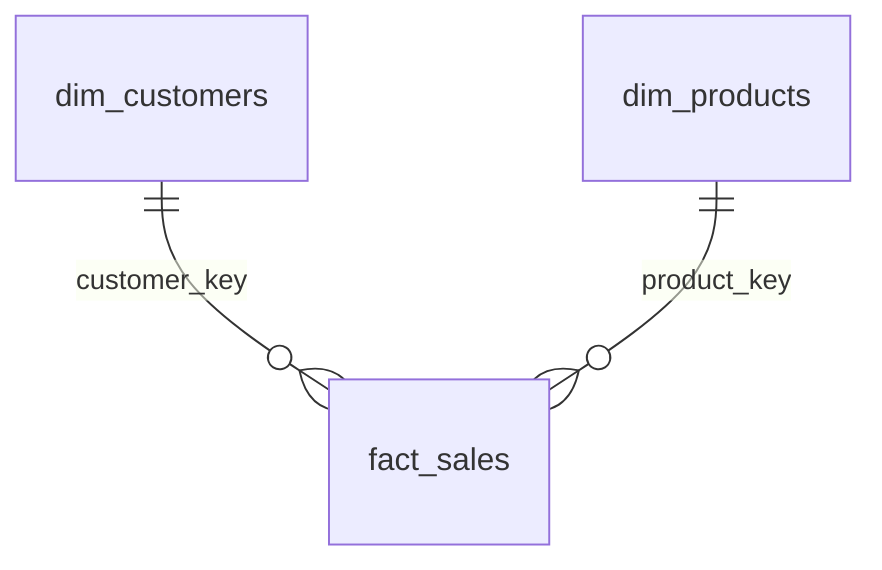

# Findings-Exploratory data analysis
 
## 📊Database Overview
The project consists three tables, consisting sales data about bike accessories.
- `dim_customers`- 18,484 rows, 10 columns
- `dim_products` - 295 rows, 11 columns
- `fact_sales` - 60,398 rows, 9 columns
## Entity Relationship Diagram

Table existence and structure were confirmed via `information_schema.tables` and `information_schema.columns` before any analysis began.
## dim_products
**Structure:** 295 rows, 11 columns. 
- Primary key: `product_key`. 

**Categorical structure:** 5 distinct categories, 37 distinct subcategories, 5 distinct product lines. 

**Nulls:** 7 rows have null `category`, `subcategory`, and `maintenance` 

**Duplicates:** 
- No duplicate, full rows,

**Dimension vs. measure:** All columns are dimensions (descriptive attributes) 
except `cost`.
## dim_customers
**Structure:** 18,484 rows, 10 columns. 
- Primary key: `customer_key`. 

**Identifier consistency:** Verified that `customer_key`, `customer_id`, and 
`customer_number` are all perfectly 1:1 with each other- no nulls, no 
duplicates, and no inconsistent pairings across all 18,484 rows.

**Name collisions:** Several pairs of customers share the same first and last name.

Cross-checked against `country`, `gender`, and `birthdate`,
confirmed these are distinct individuals with coincidentally matching names, 
not duplicate customer records.

**Categorical columns:**
- `country` — 7 distinct values. No true NULLs, but 337 rows use the 
  literal placeholder string `'n/a'` instead of a real country.
- `gender` - 3 values: Male, Female, and a missing/unknown category.
- `marital_status` -c 2 values: Married, Unmarried.

**birthdate:** 17 nulls. 6,135 distinct values out of 18,467 non-null rows 
(duplicates expected and not problematic for a date column). 

Range: 
**`1916-02-10`** (oldest customer, age ~110) to **`1986-06-25`** (youngest customer,age ~40). 

**create_date:** No nulls. Range: **`2025-10-06`** to **`2026-01-27`** , a  
tight ~4-month window for an entire customer base
## fact_sales

**Structure:** 60,398 rows, 9 columns.
- Primary key: `order_number`. 
- Foreign keys: `product_key`, `customer_key`.

**Grain:** one row per product per order

`order_number` repeats (27,659 distinct values across 60,398 rows) 

A single order contains multiple products -verified by 
inspecting repeated `order_number`s directly: `customer_key` stays constant within an order while `product_key` varies. 

This means `SUM(sales_amount) GROUP BY order_number` gives order totals, while grouping by `customer_key` 
gives total spend across all of a customer's orders.

**Referential integrity:** Verified every `product_key` in `fact_sales` 
exists in `dim_products`, and every `customer_key` exists in `dim_customers` 
- no orphaned foreign keys (checked via `LEFT JOIN ... WHERE ... IS NULL`).

**order_date:** 19 nulls 

Range: **`2010-12-29`** to 
**`2014-01-28`**. No gaps in the monthly order sequence across the full range.

**shipping_date / due_date:** No nulls in either column. 

- Verified logical 
date ordering (`order_date < shipping_date < due_date`) holds with no 
violations.

**Measures:**
- `sales_amount` — min 2, max 3,578, avg 486.05
- `quantity` — min 1, max 10, avg 1.00
- `price` — min 2, max 3,578, avg 486.05 (matches `sales_amount` 
  coincidentally)

## Magnitude & Ranking Observations

**Product revenue tiering:** Total sales by `product_key` shows a clear 
tier structure rather than a smooth decline. The top products form a 
distinct high-revenue cluster, with a sharp ~300,000 drop into the next tier.

Within that top cluster, a secondary pattern emerged: ranks 1–6 achieve 
their revenue through higher unit volume (~560+ units), while the lower ranks 
achieve similar revenue through significantly higher per-unit `cost` despite 
lower volume (~337 units).

**Revenue by country:** Customer base spans 7 countries. Revenue is heavily 
concentrated in 2 countries- the **US** and **Australia** lead with ~9.16M and ~9.06M respectively, 
while the next country (UK) drops sharply to ~3.39M. 

This concentration is worth deeper investigation in the analysis 
phase.

**Top/bottom customers by spend:** Identified the top 5 and bottom 5 
customers by total `sales_amount` across all their orders.

