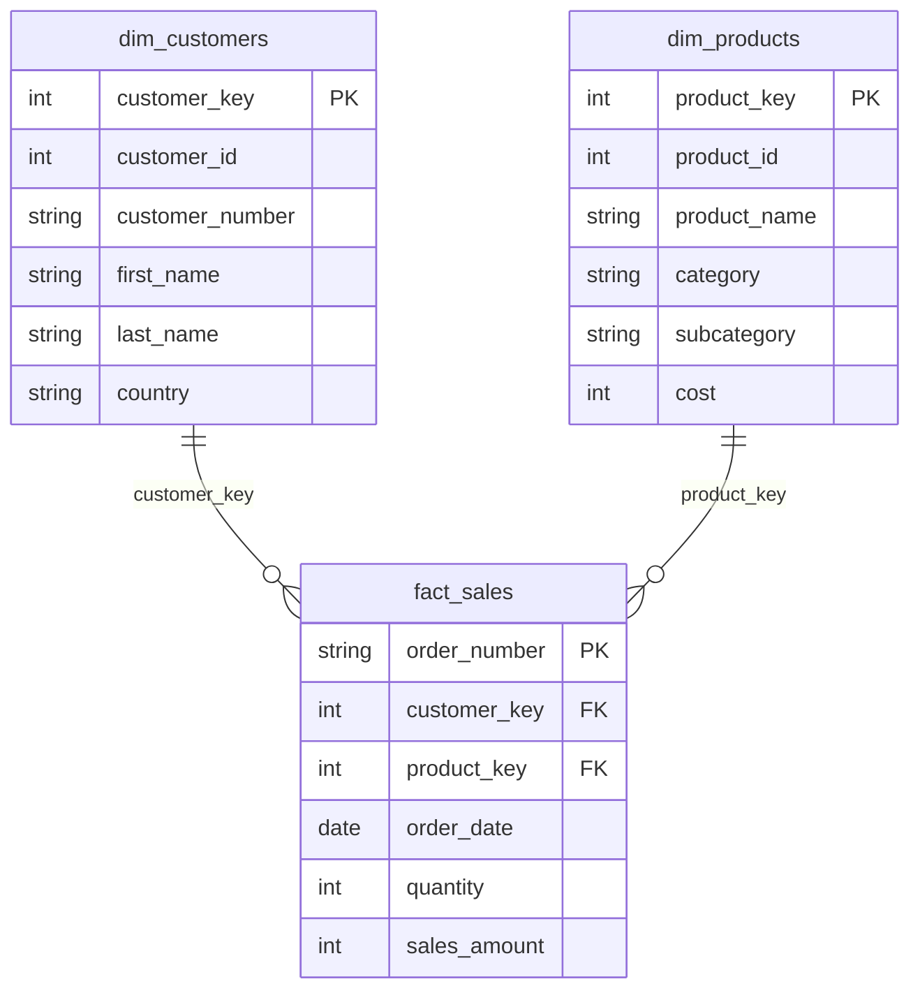

# Findings-Exploratory data analysis
 
## 📋Executive Summary

An exploratory data analysis (EDA) was conducted on a sales database containing customer, product, and transactional sales data. The objective was to understand the database structure, validate data quality, verify relationships between tables, and identify characteristics that could influence subsequent business analysis.

- All three tables were successfully validated.
- Structural validation confirmed unique primary keys and complete referential integrity across all tables.
- Minor data quality issues were identified (missing product attributes, placeholder country values, missing birthdates, and missing order dates). None of these issues compromise the overall usability of the dataset.
- Initial revenue concentration and product performance patterns were identified for deeper investigation.

## 📊 Database Overview

The database follows a star schema consisting of two dimension tables and one fact table representing bicycle product sales.

| Table | Rows | Columns | Description |
|:------|-----:|--------:|:------------|
| `dim_customers` | 18,484 | 10 | Customer data |
| `dim_products` | 295 | 11 | Product catalog |
| `fact_sales` | 60,398 | 9 | Transactional sales records |
### Entity Relationship Diagram

Table metadata was validated using information_schema.tables and information_schema.columns prior to analysis.
## 📦dim_products
**Structure:** 295 rows, 11 columns. 
- Primary key: `product_key`. 

**Categorical structure:** 5 distinct categories, 37 distinct subcategories, 5 distinct product lines. 

**Nulls:** 7 rows have null `category`, `subcategory`, and `maintenance` 

**Duplicates:** 
- No duplicate, full rows,

**Dimension vs. measure:** All columns are dimensions (descriptive attributes) 
except `cost`.
## 👥dim_customers
**Structure:** 18,484 rows, 10 columns. 
- Primary key: `customer_key`. 

**Identifier consistency:** Verified that `customer_key`, `customer_id`, and 
`customer_number` are all perfectly 1:1 with each other- no nulls, no 
duplicates, and no inconsistent pairings across all 18,484 rows.

**Name collisions:** Multiple customers share identical names; validation against birthdate, gender, and country confirmed these represent distinct individuals rather than duplicate records.

**Categorical columns:**
- `country` - 7 distinct values. No true NULLs, but 337 rows use the 
  literal placeholder string `'n/a'` instead of a real country.
- `gender` - 3 values: Male, Female, and a missing/unknown category.
- `marital_status` -c 2 values: Married, Unmarried.

**birthdate:** 17 nulls. 6,135 distinct values out of 18,467 non-null rows 
(duplicates expected and not problematic for a date column). 

Range: 
**`1916-02-10`** (oldest customer, age ~110) to **`1986-06-25`** (youngest customer,age ~40). 

**create_date:** No nulls. Range: **`2025-10-06`** to **`2026-01-27`** , a  
tight ~4-month window for an entire customer base
## 🚚fact_sales

**Structure:** 60,398 rows, 9 columns.
- Primary key: `order_number`. 
- Foreign keys: `product_key`, `customer_key`.

**Grain:** 
> The fact table stores one record per product per order.

`order_number` repeats (27,659 distinct values across 60,398 rows) 

A single order contains multiple products -verified by 
inspecting repeated `order_number`s directly: `customer_key` stays constant within an order while `product_key` varies. 

This means `SUM(sales_amount) GROUP BY order_number` gives order totals, while grouping by `customer_key` 
gives total spend across all of a customer's orders.

**Referential integrity:** Verified every `product_key` in `fact_sales` 
exists in `dim_products`, and every `customer_key` exists in `dim_customers` 
- no orphaned foreign keys (checked via `LEFT JOIN ... WHERE ... IS NULL`).

**order_date:** 19 nulls 

Range: **`2010-12-29`** to 
**`2014-01-28`**. No gaps in the monthly order sequence across the full range.

**shipping_date / due_date:** No nulls in either column. 

- Verified logical 
date ordering (`order_date < shipping_date < due_date`) holds with no 
violations.

**Measures:**
- `sales_amount` - min 2, max 3,578, avg 486.05
- `quantity` - min 1, max 10, avg 1.00
- `price` - min 2, max 3,578, avg 486.05 (matches `sales_amount` 
  coincidentally)

## 🔍Magnitude & Ranking Observations

**Product revenue tiering:** Total sales by `product_key` shows a clear 
tier structure rather than a smooth decline. The top products form a 
distinct high-revenue cluster, with a sharp ~300,000 drop into the next tier.

Within that top cluster, a secondary pattern emerged: ranks 1–6 achieve 
their revenue through higher unit volume (~560+ units), while the lower ranks 
achieve similar revenue through significantly higher per-unit `cost` despite 
lower volume (~337 units).

**Revenue by country:** Customer base spans 7 countries. Revenue is heavily 
concentrated in 2 countries- the **US** and **Australia** lead with ~9.16M and ~9.06M respectively, 
while the next country (UK) drops sharply to ~3.39M. 

> This concentration is worth deeper investigation in the analysis phase.

**Top/bottom customers by spend:** Identified the top 5 and bottom 5 
customers by total `sales_amount` across all their orders.

## Analysis Readiness

The dataset is suitable for business analysis.

Key validations performed during EDA include:

- Primary keys are unique.
- Foreign key relationships are intact.
- The fact table grain was confirmed as one product per order line.
- Date relationships are logically consistent.
- Minor missing values and placeholder entries were identified and documented.

**No structural issues were found that would prevent further analysis.**

